# Shaddy


Shaddy is a collection of shaders made for Kerbal Space Program, not to be confused with [Shabby](https://github.com/taniwha/Shabby), a shader asset bundle loader that you most likely also need to use to load Shaddy shaders :)

---

## Usage

### If you are a player...

Shaddy does not do anything by itself, it is designed to be used by other mods. If you run into any problem with the shader please feel free to report it as an issue.

Despite that, Shaddy does come with a set of [Textures Unlimited](https://forum.kerbalspaceprogram.com/index.php?/topic/167450-*) config for Stock and ReStock parts. They will only activate if you installed both Textures Unlimited and [Module Manager](https://forum.kerbalspaceprogram.com/index.php?/topic/50533-*) at the same time.

Goto [Demo section](#demo) to see the effect preview.

### If you are a modder...

You may want to use [Shabby](https://github.com/taniwha/Shabby) to load Shaddy shaders to your parts. Alternatively, you can also use your own shader loader or [Textures Unlimited](https://forum.kerbalspaceprogram.com/index.php?/topic/167450-*).

**Use Shabby:**

To start making mods using Shaddy and Shabby:

* First download the SDK in [GitHub Release](https://github.com/Icecovery/Shaddy/releases).

* Then, import the downloaded unitypackage to your unity project. 

* You should now see a folder named `Shaders` appear under your Assets folder.

* Create a material that uses these new shaders and apply it to your part.

* Export the part as if it is using stock KSP shaders, and ignore the Part Tool warning on using a stock shader.

* Install Shaddy from CKAN or [SpaceDock](https://spacedock.info/mod/3064/Shaddy) to GameData.

* If you are using [Shabby](https://github.com/taniwha/Shabby) to load Shaddy shaders, make sure it is installed, too.

* Open the game and make sure the shader is loaded correctly on the part.

* ???

* Profit.

In this case, Shaddy and Shabby will need to be added to your mod's dependency.

**Use Textures Unlimited:**

If you want the translucent shader to be optional or if you want to add translucent effect to a existing mod, you can use Textures Unlimited's shader replacement feature. 

Starting from version 2.0, Shaddy comes with Textures Unlimited shader bundle and shader data definition, it is located at `GameData/Shaddy/Patches/ShaddyTU.cfg`.

Textures Unlimited config documentation can be found at [Textures Unlimited wiki page](https://github.com/shadowmage45/TexturesUnlimited/wiki/Config-Documentation). Shaddy's stock config (found under `GameData/Shaddy/Patches/`) can also be used as a reference.

In this case, Shaddy and Textures Unlimited will need to be added to your mod's dependency, Shabby will not be a required dependency as Textures Unlimited uses its own shader loader.

**Notes on HDR color properties when configuring Textures Unlimited:**

Some color property has their range marked as *HDR*, which means it supports Unity HDR color that can have a value greater than (255, 255, 255). To find what number you need to use in Textures Unlimited config, multiply each of the R, G, and B channels of your desired color value by the intensity, and round to the nearest integer.

For example: if a color in the Unity editor has an RGB value of (102, 204, 255) and intensity of 4.2, in Textures Unlimited config, write: 

```cs
PROPERTY
{
	name = _SomePropertyName
	color = 428, 857, 1071 
	// rgb (102, 204, 255) intensity 4.2
	// 102 * 4.2 = 428.4, rounded to 428
	// 204 * 4.2 = 856.8, rounded to 857
	// 255 * 4.2 = 1071
}
```

**Modeling Notes:**

All Shaddy/Translucent shaders are double-sided (No back face or front face culling). This means if you are making a parachute or a leaf model that has the same texture on both sides, you don't have to duplicate the mesh and then flip the faces, one-sided mesh will work just as fine as a double-sided one.

---

## Conflict

If you installed the Shabby v0.2.0 "unofficial build" and Textures Unlimited at the same time, there will be a conflict, resulting in failed shader replacement from Textures Unlimited (Pink parts). This has been solved by the newest change in Shabby (>= v0.3.0). It is available on CKAN, or you can get it here: http://taniwha.org/~bill/Shabby_v0.3.0.zip

---

## Download

For players: [SpaceDock](https://spacedock.info/mod/3064/Shaddy), also available on [CKAN](https://github.com/KSP-CKAN/CKAN).

For modders: [SDK](https://github.com/Icecovery/Shaddy/releases). 

Note that not all versions of the mod will have a corresponding version of SDK since shaders might not change between mod releases. Download the latest SDK available if no SDK matches the latest mod version. E.g.: If the latest mod version is v2.2, but the latest SDK version is v2.1, use SDK v2.1.

---

## Installing

For players: Delete everything previously installed under `GameData/Shaddy/` before extracting the zip file. Or use CKAN.

For modders: Delete all previously installed Shaddy shader under `Assets/Shaders/`, then install `Shaddy_vx.x.unitypackage` to your Unity project.

---

## Demo

<details>
<summary><b>Click to Expand</b></summary>

[Shaddy/Translucent](#shaddytranslucent) shader comparing with KSP/Diffuse shader on a stock parachute

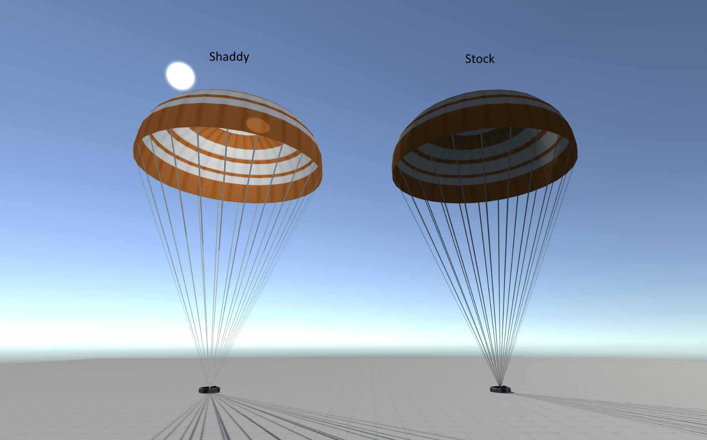

Parachute LOD effect, see [Setup Parachute LOD](#setup-parachute-lod) section on how to set it up.


[Shaddy/Translucent Cutoff (Mapped) (Bumped)](#shaddytranslucent-cutoff-mapped-bumped) shader comparing with KSP/Alpha/Cutoff (Bumped) on a leaf

Front

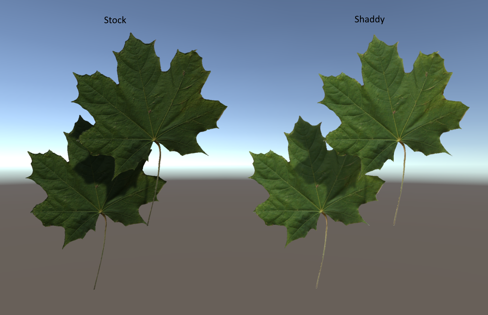

Back

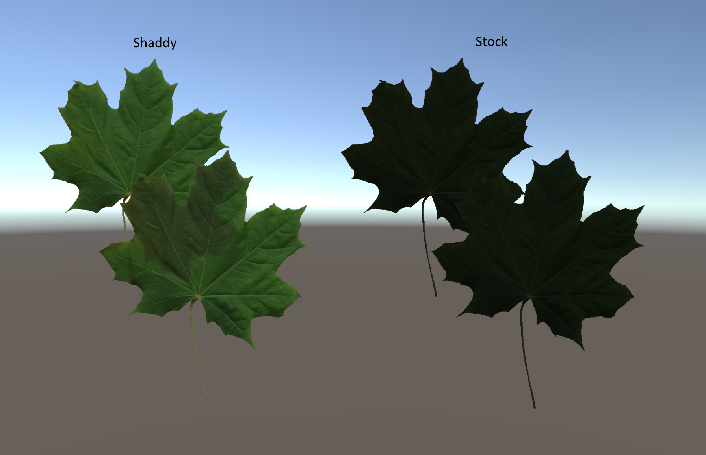

[Shaddy/Translucent Specular](#shaddytranslucent-specular) shader comparing with KSP/Specular on the stock large solar panel

Front

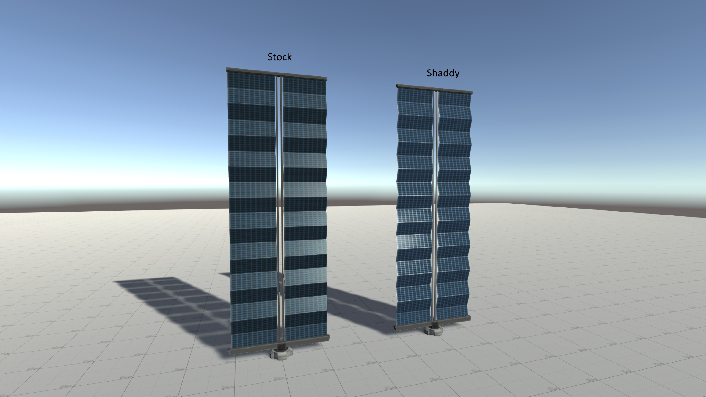

Back

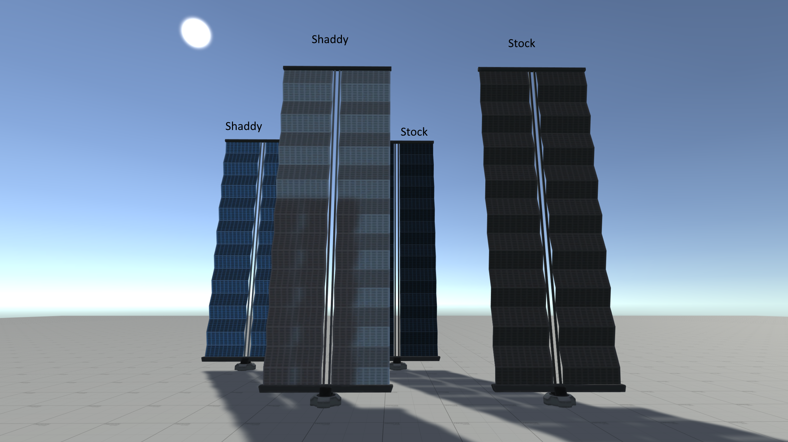

[Shaddy/Translucent Specular](#shaddytranslucent-specular) shader's look when interacting with light


[Shaddy/Translucent Specular (Mapped)](#shaddytranslucent-specular-mapped) shader on a plane that vaguely represents the solar panels on the ISS

Front

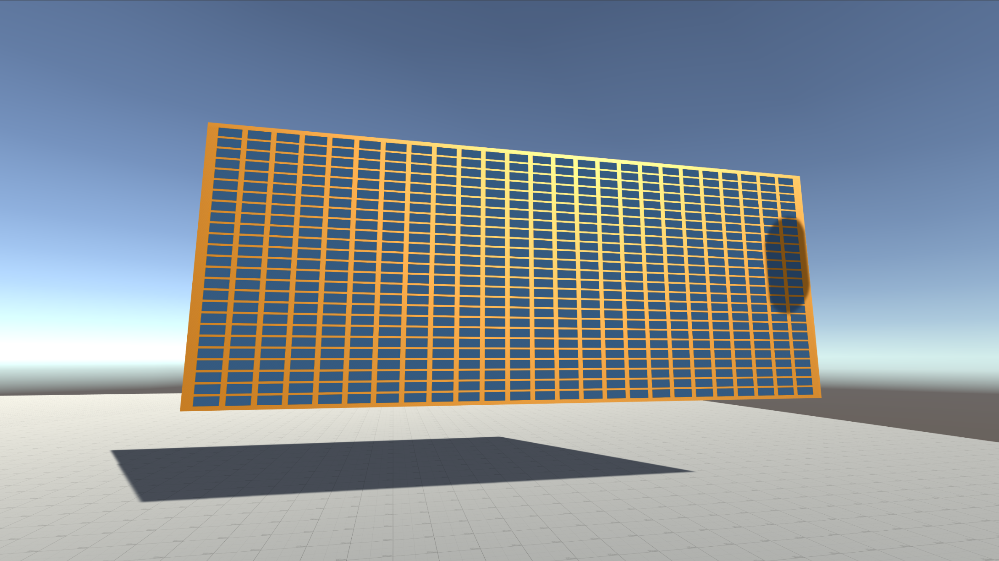

Back

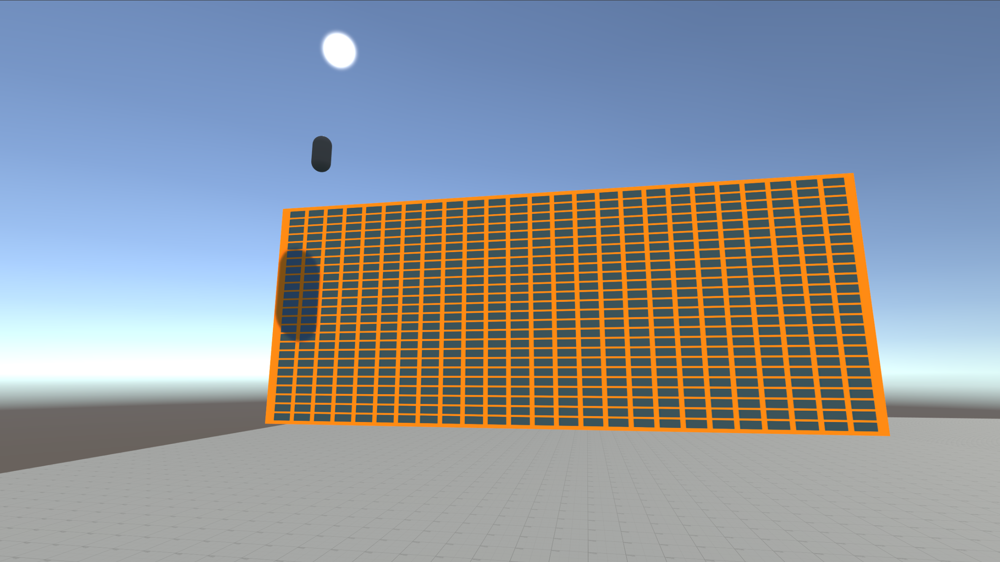

[Shaddy/Translucent Specular (Spec Mapped) (Bumped)](#shaddytranslucent-specular-spec-mapped-bumped) shader on Restock solar panels, now with transmission texture by [Rodg88](https://github.com/Rodg88)


[Shaddy/Translucent](#shaddytranslucent) shader vs stock diffuse shader on stock Communotron 88-88 antenna

Top: Stock shader

Bottom: Shaddy shader

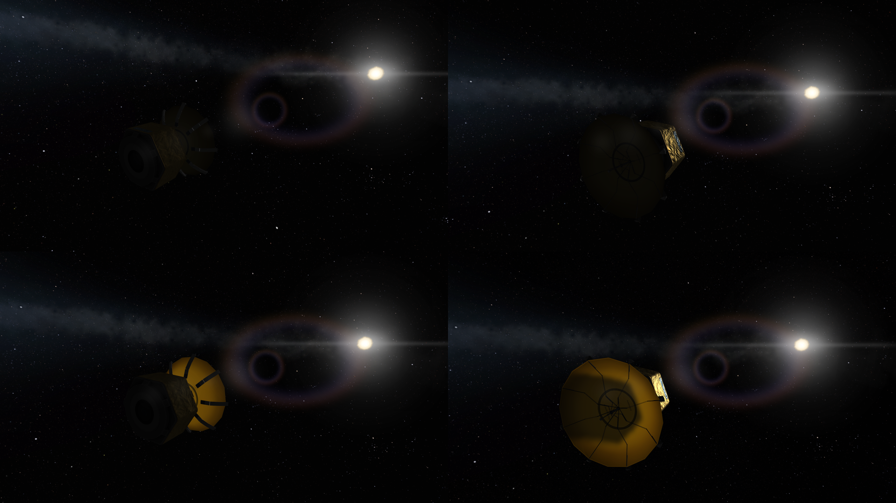

</details>

---

## Available Shaders

<details>
<summary><b>Click to Expand</b></summary>

### Manifest

| Name                                                                                          | Render Queue |
|-----------------------------------------------------------------------------------------------|:------------:|
| [Translucent](#shaddytranslucent)                                                             | 2000         |
| [Translucent (Bumped)](#shaddytranslucent-bumped)                                             | 2000         |
| [Translucent (Mapped)](#shaddytranslucent-mapped)                                             | 2000         |
| [Translucent (Mapped) (Bumped)](#shaddytranslucent-mapped-bumped)                             | 2000         |
| [Translucent Specular](#shaddytranslucent-specular)                                           | 2000         |
| [Translucent Specular (Bumped)](#shaddytranslucent-specular-bumped)                           | 2000         |
| [Translucent Specular (Mapped)](#shaddytranslucent-specular-mapped)                           | 2000         |
| [Translucent Specular (Mapped) (Bumped)](#shaddytranslucent-cutoff-mapped-bumped)             | 2000         |
| [Translucent Specular (All Mapped) (Bumped)](#shaddytranslucent-specular-all-mapped-bumped)   | 2000         |
| [Translucent Specular (Spec Mapped) (Bumped)](#shaddytranslucent-specular-spec-mapped-bumped) | 2000         |
| [Translucent Cutoff](#shaddytranslucent-cutoff)                                               | 2450         |
| [Translucent Cutoff (Bumped)](#shaddytranslucent-cutoff-bumped)                               | 2450         |
| [Translucent Cutoff (Mapped)](#shaddytranslucent-cutoff-mapped)                               | 2450         |
| [Translucent Cutoff (Mapped) (Bumped)](#shaddytranslucent-cutoff-mapped-bumped)               | 2450         |
| [Translucent (Monocolor)](#shaddytranslucent-monocolor)                                       | 2000         |
| [Translucent (Monocolor) (Clip Out)](#shaddytranslucent-monocolor-clip-out)                   | 2450         |
| [Translucent (Monocolor) (Fade In)](#shaddytranslucent-monocolor-fade-in)                     | 3000         |

**NOTE:** Replacement for KSP/Bumped Specular (Mapped) is [Translucent Specular (All Mapped) (Bumped)](#shaddytranslucent-specular-all-mapped-bumped) or [Translucent Specular (Spec Mapped) (Bumped)](#shaddytranslucent-specular-spec-mapped-bumped), **Not** [Translucent Specular (Mapped)](#shaddytranslucent-specular-mapped)

### Shader Property Descriptions

These are the descriptions for some properties that are commonly found in all Shaddy shaders, but do note that **Not All shaders have these properties**. Which shader contains what properties can be found in their own section. 

| Property             | Type    | Description |
|----------------------|---------|-------------|
| `_Color`             | Color   | The base color of a one-colored object |
| `_MainTex`           | Texture | Base color / albedo / diffuse map of the object |
| `_BumpMap`           | Texture | Normal / bump map of the object |
| `_SpecColor`         | Color   | The color of the specular highlight. Works in the same way as in KSP/Specular |
| `_Shininess`         | Float   | Controls how shiny the specular highlight is. Works in the same way as in KSP/Specular |
| `_TransmissionColor` | Color   | Controls the color of the surface when the light source is behind the surface |
| `_TransmissionMap`   | Texture | Per-pixel transmission color map |
| `_TransmissionPower` | Float   | Value multiplier of the transmission map |
| `_AmbientBase`       | Float   | Controls how much the ambient light affect the surface color |

### Shaddy/Translucent

Most basic translucent shader.

| Property             | Type    | Range    | Note |
|----------------------|---------|----------|------|
| `_MainTex`           | Texture |          |      |
| `_TransmissionColor` | Color   | HDR      |      |
| `_AmbientBase`       | Float   | 0 - 1    |      |

### Shaddy/Translucent (Bumped)

Shaddy/Translucent but with normal map support

| Property             | Type    | Range    | Note |
|----------------------|---------|----------|------|
| `_MainTex`           | Texture |          |      |
| `_BumpMap`           | Texture |          |      |
| `_TransmissionColor` | Color   | HDR      |      |
| `_AmbientBase`       | Float   | 0 - 1    |      |

### Shaddy/Translucent (Mapped)

Shaddy/Translucent but uses per-pixel transmission value

| Property             | Type    | Range    | Note |
|----------------------|---------|----------|------|
| `_MainTex`           | Texture |          |      |
| `_TransmissionMap`   | Texture |          |      |
| `_TransmissionPower` | Float   |          |      |
| `_AmbientBase`       | Float   | 0 - 1    |      |

### Shaddy/Translucent (Mapped) (Bumped)

Shaddy/Translucent (Bumped) but uses per-pixel transmission value

| Property             | Type    | Range    | Note |
|----------------------|---------|----------|----- |
| `_MainTex`           | Texture |          |      |
| `_BumpMap`           | Texture |          |      |
| `_TransmissionMap`   | Texture |          |      |
| `_TransmissionPower` | Float   |          |      |
| `_AmbientBase`       | Float   | 0 - 1    |      |

### Shaddy/Translucent Specular

KSP/Specular but translucent

| Property             | Type    | Range    | Note |
|----------------------|---------|----------|------|
| `_MainTex`           | Texture |          | Alpha channel controls glossiness, same as KSP/Specular |
| `_SpecColor`         | Color   |          |      |
| `_Shininess`         | Float   | 0.03 - 1 |      |
| `_TransmissionColor` | Color   | HDR      |      |
| `_AmbientBase`       | Float   | 0 - 1    |      |

### Shaddy/Translucent Specular (Bumped)

KSP/Bumped Specular but translucent

| Property             | Type    | Range    | Note |
|----------------------|---------|----------|------|
| `_MainTex`           | Texture |          | Alpha channel controls glossiness, same as KSP/Specular |
| `_SpecColor`         | Color   |          |      |
| `_Shininess`         | Float   | 0.03 - 1 |      |
| `_BumpMap`           | Texture |          |      |
| `_TransmissionColor` | Color   | HDR      |      |
| `_AmbientBase`       | Float   | 0 - 1    |      |

### Shaddy/Translucent Specular (Mapped)

KSP/Specular but uses per-pixel transmission value

| Property             | Type    | Range    | Note |
|----------------------|---------|----------|------|
| `_MainTex`           | Texture |          | Alpha channel controls glossiness, same as KSP/Specular |
| `_SpecColor`         | Color   |          |      |
| `_Shininess`         | Float   | 0.03 - 1 |      |
| `_TransmissionMap`   | Texture |          |      |
| `_TransmissionPower` | Float   |          |      |
| `_AmbientBase`       | Float   | 0 - 1    |      |

### Shaddy/Translucent Specular (Mapped) (Bumped)

KSP/Bumped Specular but uses per-pixel transmission value

| Property             | Type    | Range    | Note |
|----------------------|---------|----------|----- |
| `_MainTex`           | Texture |          | Alpha channel controls glossiness, same as KSP/Specular |
| `_SpecColor`         | Color   |          |      |
| `_Shininess`         | Float   | 0.03 - 1 |      |
| `_BumpMap`           | Texture |          |      |
| `_TransmissionMap`   | Texture |          |      |
| `_TransmissionPower` | Float   |          |      |
| `_AmbientBase`       | Float   | 0 - 1    |      |

### Shaddy/Translucent Specular (All Mapped) (Bumped)

Drop-in replacement of KSP/Bumped Specular (Mapped), per-pixel transmission value via the transmission map

| Property             | Type    | Range    | Note |
|----------------------|---------|----------|----- |
| `_MainTex`           | Texture |          |      |
| `_SpecMap`           | Texture |          |      |
| `_SpecTint`          | Color   | 0 - 0.1  |      |
| `_Shininess`         | Float   | 0.03 - 1 |      |
| `_BumpMap`           | Texture |          |      |
| `_TransmissionMap`   | Texture |          |      |
| `_TransmissionPower` | Float   |          |      |
| `_AmbientBase`       | Float   | 0 - 1    |      |

### Shaddy/Translucent Specular (Spec Mapped) (Bumped)

Drop-in replacement of KSP/Bumped Specular (Mapped), single HDR transmission color value

| Property             | Type    | Range    | Note |
|----------------------|---------|----------|----- |
| `_MainTex`           | Texture |          |      |
| `_SpecMap`           | Texture |          |      |
| `_SpecTint`          | Color   | 0 - 0.1  |      |
| `_Shininess`         | Float   | 0.03 - 1 |      |
| `_BumpMap`           | Texture |          |      |
| `_TransmissionColor` | Color   | HDR      |      |
| `_AmbientBase`       | Float   | 0 - 1    |      |

### Shaddy/Translucent Cutoff

Shaddy/Translucent with alpha clipping

| Property             | Type    | Range    | Note |
|----------------------|---------|----------|------|
| `_MainTex`           | Texture |          | Alpha channel is used for opacity clipping |
| `_TransmissionColor` | Color   | HDR      |      |
| `_AmbientBase`       | Float   | 0 - 1    |      |

### Shaddy/Translucent Cutoff (Bumped)

Shaddy/Translucent (Bumped) with alpha clipping

| Property             | Type    | Range    | Note |
|----------------------|---------|----------|------|
| `_MainTex`           | Texture |          | Alpha channel is used for opacity clipping |
| `_BumpMap`           | Texture |          |      |
| `_TransmissionColor` | Color   | HDR      |      |
| `_AmbientBase`       | Float   | 0 - 1    |      |

### Shaddy/Translucent Cutoff (Mapped)

Shaddy/Translucent (Mapped) with alpha clipping

| Property             | Type    | Range    | Note |
|----------------------|---------|----------|------|
| `_MainTex`           | Texture |          | Alpha channel is used for opacity clipping |
| `_TransmissionMap`   | Texture |          |      |
| `_TransmissionPower` | Float   |          |      |
| `_AmbientBase`       | Float   | 0 - 1    |      |

### Shaddy/Translucent Cutoff (Mapped) (Bumped)

Shaddy/Translucent (Mapped) (Bumped) with alpha clipping

| Property             | Type    | Range    | Note |
|----------------------|---------|----------|----- |
| `_MainTex`           | Texture |          | Alpha channel is used for opacity clipping |
| `_BumpMap`           | Texture |          |      |
| `_TransmissionMap`   | Texture |          |      |
| `_TransmissionPower` | Float   |          |      |
| `_AmbientBase`       | Float   | 0 - 1    |      |

### Shaddy/Translucent (Monocolor)

One-colored version of Shaddy/Translucent

| Property             | Type    | Range    | Note |
|----------------------|---------|----------|------|
| `_Color`             | Color   |          |      |
| `_TransmissionColor` | Color   | HDR      |      |
| `_AmbientBase`       | Float   | 0 - 1    |      |

### Shaddy/Translucent (Monocolor) (Clip Out)

Shaddy/Translucent (Monocolor) but will clip out after some distance, useful when combined with Shaddy/Translucent (Monocolor) (Fade In) to create parachute rope LOD effect

| Property             | Type    | Range    | Note |
|----------------------|---------|----------|------|
| `_Color`             | Color   |          |      |
| `_TransmissionColor` | Color   | HDR      |      |
| `_AmbientBase`       | Float   | 0 - 1    |      |
| `_ClipOutDistance`   | Float   |          | Object will clip out after this distance |

### Shaddy/Translucent (Monocolor) (Fade In)

Shaddy/Translucent (Monocolor) but will fade in after some distance, useful when combined with Shaddy/Translucent (Monocolor) (Clip Out) to create parachute rope LOD effect

| Property             | Type    | Range    | Note |
|----------------------|---------|----------|------|
| `_Color`             | Color   |          | The color of the fresnel effect |
| `_TransmissionColor` | Color   | HDR      |      |
| `_AmbientBase`       | Float   | 0 - 1    |      |
| `_FresnelPower`      | Float   |          | Controls the power of the fresnel effect |
| `_Opacity`           | Float   |          | Controls the opacity of the fresnel effect |
|`_FadeInStartDistance`| Float   |          | Object will start to fade in at this distance |
| `_FadeInEndDistance` | Float   |          | Object will be completely faded in at this distance|

</details>

---

## Setup Parachute LOD

<details>
<summary><b>Click to Expand</b></summary>

In this example, the Canopy is using [Translucent (Bumped)](#shaddytranslucent-bumped), Rope is using [Translucent (Monocolor) (Clip Out)](#shaddytranslucent-monocolor-clip-out), Rope (low poly) is using [Translucent (Monocolor) (Fade In)](#shaddytranslucent-monocolor-fade-in), and Rope Core is using [Translucent (Monocolor)](#shaddytranslucent-monocolor).

Canopy

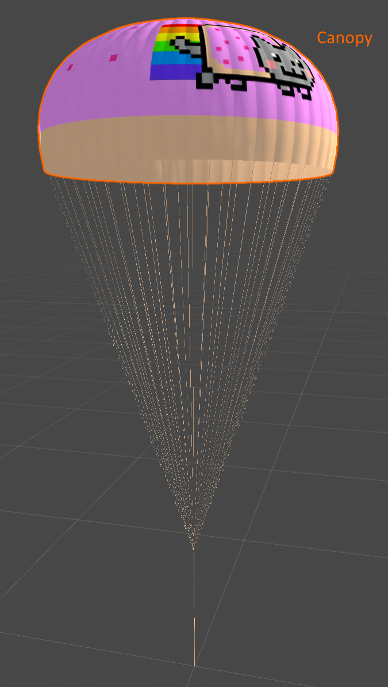

Rope

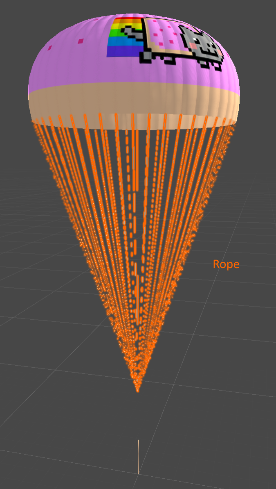

Rope Low Poly


Rope Core

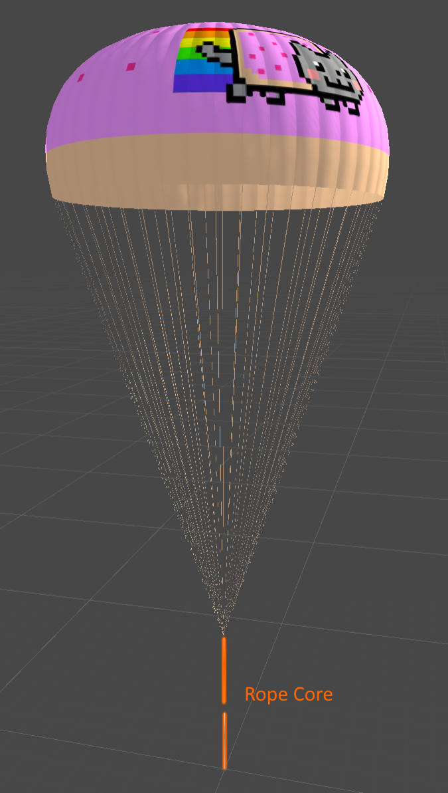

Basic hierarchy setup


The Rope low poly model looks like this, `Cast Shadows` should be set to `Off` in the Mesh Renderer.

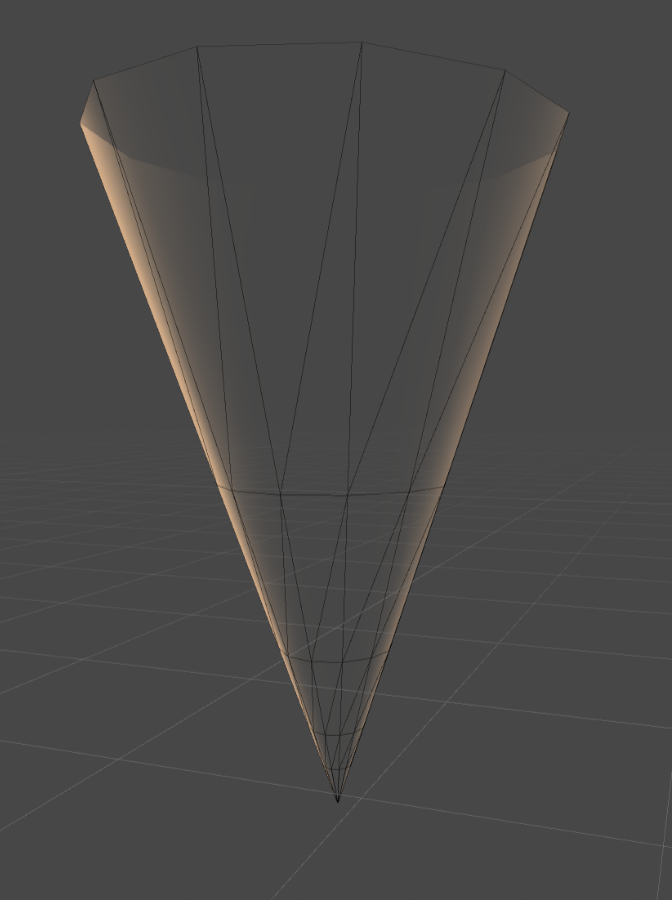

</details>

---

## Credits

Shaders are made by [Icecovery](https://github.com/Icecovery) using [Shader Forge](https://github.com/FreyaHolmer/ShaderForge).

Textures Unlimited config by [JonnyOThan](https://github.com/JonnyOThan).

Restock transmission texture by [Rodg88](https://github.com/Rodg88).

---

## License

This mod is released under the [MIT License](https://github.com/Icecovery/Shaddy/blob/master/LICENSE).

---

## Redistribution

You are free to bundle this mod in your mod releases. You are also free or include the shaders in your own asset bundle, but be sure to change their namespace to avoid naming collision.