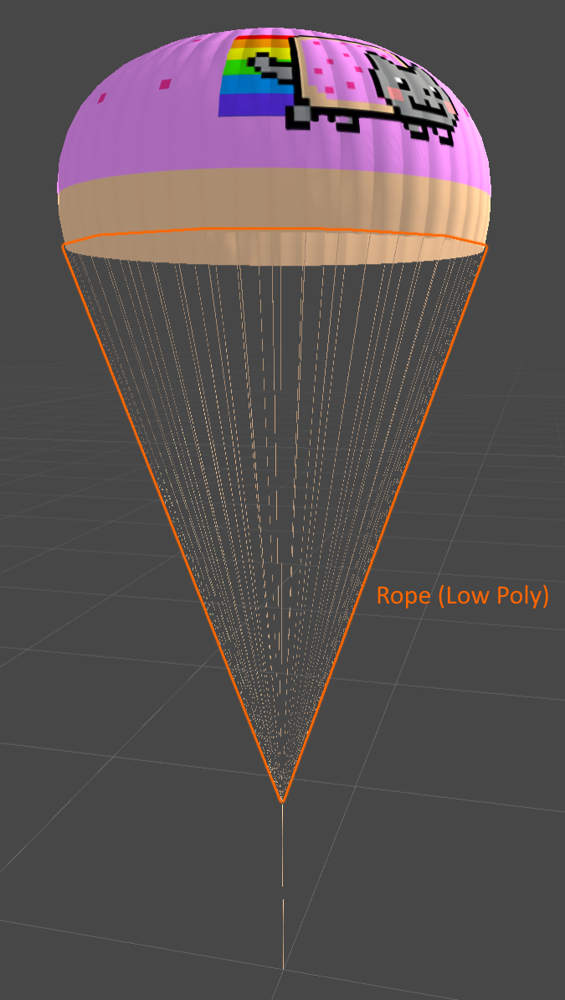

# Shaddy

Shaddy is a collection of shaders made for Kerbal Space Program, not to be confused with [Shabby](https://github.com/taniwha/Shabby), a shader asset bundle loader that you most likely also need to use to load Shaddy shaders :)

---

## Usage

### If you are a player...

Shaddy does not do anything by itself, it is designed to be used by other mods. If you run into any problem with the shader please feel free to report it as an issue.

### If you are a modder...

You may want to use [Shabby](https://github.com/taniwha/Shabby) to load Shaddy shaders to your parts. Alternatively, you can also use your own shader loader.

To start making mods using Shaddy:

* First download the SDK in [GitHub Release](https://github.com/Icecovery/Shaddy/releases).

* Then, import the downloaded unitypackage to your unity project. 

* You should now see a folder named `Shaders` appear under your Assets folder.

* Create material that uses these new shaders.

* Export the part as if it is using stock KSP shaders, and ignore the Part Tool warning on using a stock shader.

* Install Shaddy from CKAN or [SpaceDock](https://spacedock.info/mod/3064/Shaddy) to GameData.

* If you are using [Shabby](https://github.com/taniwha/Shabby) to load Shaddy shaders, make sure it is installed, too.

* Open the game and make sure the shader is loaded correctly on the part.

* ???

* Profit.

Notes:

All Shaddy/Translucent shaders are double-sided (No back face or front face culling). This means if you are making a parachute or a leaf model that has the same texture on both sides, you don't have to duplicate the mesh and then flip the faces, one-sided mesh will work just as fine as a double-sided one.

---

## Download

For players: [SpaceDock](https://spacedock.info/mod/3064/Shaddy)

For modders: [SDK](https://github.com/Icecovery/Shaddy/releases)

---

## Demo

<b>Click to Expand</b>

[Shaddy/Translucent](#shaddytranslucent) shader comparing with KSP/Diffuse shader on a stock parachute

Parachute LOD effect, see [Setup Parachute LOD](#setup-parachute-lod) section on how to set it up.

[Shaddy/Translucent Cutout (Mapped) (Bumped)](#shaddytranslucent-cutout-mapped-bumped) shader comparing with KSP/Alpha/Cutoff (Bumped) on a leaf

Front

Back

[Shaddy/Translucent Specular](#shaddytranslucent-specular) shader comparing with KSP/Specular on the stock large solar panel

Front

Back

[Shaddy/Translucent Specular](#shaddytranslucent-specular) shader's look when interacting with light

[Shaddy/Translucent Specular (Mapped)](#shaddytranslucent-specular-mapped) shader on a plane that vaguely represents the solar panels on the ISS

Front

Back

---

## Available Shaders

### Manifest

| Name                                                                                  | Render Queue |
|---------------------------------------------------------------------------------------|:------------:|
| [Translucent](#shaddytranslucent)                                                     | 2000         |
| [Translucent (Bumped)](#shaddytranslucent-bumped)                                     | 2000         |
| [Translucent (Mapped)](#shaddytranslucent-mapped)                                     | 2000         |
| [Translucent (Mapped) (Bumped)](#shaddytranslucent-mapped-bumped)                     | 2000         |
| [Translucent Specular](#shaddytranslucent-specular)                                   | 2000         |
| [Translucent Specular (Bumped)](#shaddytranslucent-specular-bumped)                   | 2000         |
| [Translucent Specular (Mapped)](#shaddytranslucent-specular-mapped)                   | 2000         |
| [Translucent Specular (Mapped) (Bumped)](shaddytranslucent-specular-mapped-bumped)    | 2000         |
| [Translucent Cutout](#shaddytranslucent-cutout)                                       | 2450         |
| [Translucent Cutout (Bumped)](#shaddytranslucent-cutout-bumped)                       | 2450         |
| [Translucent Cutout (Mapped)](#shaddytranslucent-cutout-mapped)                       | 2450         |
| [Translucent Cutout (Mapped) (Bumped)](#shaddytranslucent-cutout-mapped-bumped)       | 2450         |
| [Translucent (Monocolor)](#shaddytranslucent-monocolor)                               | 2000         |
| [Translucent (Monocolor) (Clip Out)](#shaddytranslucent-monocolor-clip-out)           | 2450         |
| [Translucent (Monocolor) (Fade In)](#shaddytranslucent-monocolor-fade-in)             | 3000         |

### Common Properties

| Property             | Type    | Description |
|----------------------|---------|-------------|
| `_color`             | Color   | The base color of a one-colored object |
| `_diffuseMap`        | Texture | Base color / albedo / diffuse map of the object |
| `_normalMap`         | Texture | Normal / bump map of the object |
| `_specularColor`     | Color   | The color of the specular highlight. Works in the same way as in KSP/Specular |
| `_shininess`         | Float   | Controls how shiny the specular highlight is. Works in the same way as in KSP/Specular |
| `_transmissionColor` | Color   | Controls the color of the surface when the light source is behind the surface |
| `_transmissionMap`   | Texture | Per-pixel transmission color map |
| `_transmissionPower` | Float   | Value multiplier of the transmission map |
| `_ambientBase`       | Float   | Controls how much the ambient light affect the surface color |

### Shaddy/Translucent

Most basic translucent shader.

| Property             | Type    | Range    | Note |
|----------------------|---------|----------|------|
| `_diffuseMap`        | Texture |          |      |
| `_transmissionColor` | Color   | HDR      |      |
| `_ambientBase`       | Float   | 0 - 1    |      |

### Shaddy/Translucent (Bumped)

Shaddy/Translucent but with normal map support

| Property             | Type    | Range    | Note |
|----------------------|---------|----------|------|
| `_diffuseMap`        | Texture |          |      |
| `_normalMap`         | Texture |          |      |
| `_transmissionColor` | Color   | HDR      |      |
| `_ambientBase`       | Float   | 0 - 1    |      |

### Shaddy/Translucent (Mapped)

Shaddy/Translucent but uses per-pixel transmission value

| Property             | Type    | Range    | Note |
|----------------------|---------|----------|------|
| `_diffuseMap`        | Texture |          |      |
| `_transmissionMap`   | Texture |          |      |
| `_transmissionPower` | Float   |          |      |
| `_ambientBase`       | Float   | 0 - 1    |      |

### Shaddy/Translucent (Mapped) (Bumped)

Shaddy/Translucent (Bumped) but uses per-pixel transmission value

| Property             | Type    | Range    | Note |
|----------------------|---------|----------|----- |
| `_diffuseMap`        | Texture |          |      |
| `_normalMap`         | Texture |          |      |
| `_transmissionMap`   | Texture |          |      |
| `_transmissionPower` | Float   |          |      |
| `_ambientBase`       | Float   | 0 - 1    |      |

### Shaddy/Translucent Specular

KSP/Specular but translucent

| Property             | Type    | Range    | Note |
|----------------------|---------|----------|------|
| `_diffuseMap`        | Texture |          | Alpha channel controls glossiness, same as KSP/Specular |
| `_specularColor`     | Color   |          |      |
| `_shininess`         | Float   | 0.03 - 1 |      |
| `_transmissionColor` | Color   | HDR      |      |
| `_ambientBase`       | Float   | 0 - 1    |      |

### Shaddy/Translucent Specular (Bumped)

KSP/Bumped Specular but translucent

| Property             | Type    | Range    | Note |
|----------------------|---------|----------|------|
| `_diffuseMap`        | Texture |          | Alpha channel controls glossiness, same as KSP/Specular |
| `_specularColor`     | Color   |          |      |
| `_shininess`         | Float   | 0.03 - 1 |      |
| `_normalMap`         | Texture |          |      |
| `_transmissionColor` | Color   | HDR      |      |
| `_ambientBase`       | Float   | 0 - 1    |      |

### Shaddy/Translucent Specular (Mapped)

KSP/Specular but uses per-pixel transmission value

| Property             | Type    | Range    | Note |
|----------------------|---------|----------|------|
| `_diffuseMap`        | Texture |          | Alpha channel controls glossiness, same as KSP/Specular |
| `_specularColor`     | Color   |          |      |
| `_shininess`         | Float   | 0.03 - 1 |      |
| `_transmissionMap`   | Texture |          |      |
| `_transmissionPower` | Float   |          |      |
| `_ambientBase`       | Float   | 0 - 1    |      |

### Shaddy/Translucent Specular (Mapped) (Bumped)

KSP/Bumped Specular but uses per-pixel transmission value

| Property             | Type    | Range    | Note |
|----------------------|---------|----------|----- |
| `_diffuseMap`        | Texture |          | Alpha channel controls glossiness, same as KSP/Specular |
| `_specularColor`     | Color   |          |      |
| `_shininess`         | Float   | 0.03 - 1 |      |
| `_normalMap`         | Texture |          |      |
| `_transmissionMap`   | Texture |          |      |
| `_transmissionPower` | Float   |          |      |
| `_ambientBase`       | Float   | 0 - 1    |      |

### Shaddy/Translucent Cutout

Shaddy/Translucent with alpha clipping

| Property             | Type    | Range    | Note |
|----------------------|---------|----------|------|
| `_diffuseMap`        | Texture |          | Alpha channel is used for opacity clipping |
| `_transmissionColor` | Color   | HDR      |      |
| `_ambientBase`       | Float   | 0 - 1    |      |

### Shaddy/Translucent Cutout (Bumped)

Shaddy/Translucent (Bumped) with alpha clipping

| Property             | Type    | Range    | Note |
|----------------------|---------|----------|------|
| `_diffuseMap`        | Texture |          | Alpha channel is used for opacity clipping |
| `_normalMap`         | Texture |          |      |
| `_transmissionColor` | Color   | HDR      |      |
| `_ambientBase`       | Float   | 0 - 1    |      |

### Shaddy/Translucent Cutout (Mapped)

Shaddy/Translucent (Mapped) with alpha clipping

| Property             | Type    | Range    | Note |
|----------------------|---------|----------|------|
| `_diffuseMap`        | Texture |          | Alpha channel is used for opacity clipping |
| `_transmissionMap`   | Texture |          |      |
| `_transmissionPower` | Float   |          |      |
| `_ambientBase`       | Float   | 0 - 1    |      |

### Shaddy/Translucent Cutout (Mapped) (Bumped)

Shaddy/Translucent (Mapped) (Bumped) with alpha clipping

| Property             | Type    | Range    | Note |
|----------------------|---------|----------|----- |
| `_diffuseMap`        | Texture |          | Alpha channel is used for opacity clipping |
| `_normalMap`         | Texture |          |      |
| `_transmissionMap`   | Texture |          |      |
| `_transmissionPower` | Float   |          |      |
| `_ambientBase`       | Float   | 0 - 1    |      |

### Shaddy/Translucent (Monocolor)

One-colored version of Shaddy/Translucent

| Property             | Type    | Range    | Note |
|----------------------|---------|----------|------|
| `_color`             | Color   |          |      |
| `_transmissionColor` | Color   | HDR      |      |
| `_ambientBase`       | Float   | 0 - 1    |      |

### Shaddy/Translucent (Monocolor) (Clip Out)

Shaddy/Translucent (Monocolor) but will clip out after some distance, useful when combined with Shaddy/Translucent (Monocolor) (Fade In) to create parachute rope LOD effect

| Property             | Type    | Range    | Note |
|----------------------|---------|----------|------|
| `_color`             | Color   |          |      |
| `_transmissionColor` | Color   | HDR      |      |
| `_ambientBase`       | Float   | 0 - 1    |      |
| `_clipOutDistance`   | Float   |          | Object will clip out after this distance |

### Shaddy/Translucent (Monocolor) (Fade In)

Shaddy/Translucent (Monocolor) but will fade in after some distance, useful when combined with Shaddy/Translucent (Monocolor) (Clip Out) to create parachute rope LOD effect

| Property             | Type    | Range    | Note |
|----------------------|---------|----------|------|
| `_color`             | Color   |          | The color of the fresnel effect |
| `_transmissionColor` | Color   | HDR      |      |
| `_ambientBase`       | Float   | 0 - 1    |      |
| `_fresnelPower`      | Float   |          | Controls the power of the fresnel effect |
| `_opacity`           | Float   |          | Controls the opacity of the fresnel effect |
|`_fadeInStartDistance`| Float   |          | Object will start to fade in at this distance |
| `_fadeInEndDistance` | Float   |          | Object will be completely faded in at this distance|

---

## Setup Parachute LOD

<b>Click to Expand</b>

In this example, the Canopy is using [Translucent (Bumped)](#shaddytranslucent-bumped), Rope is using [Translucent (Monocolor) (Clip Out)](#shaddytranslucent-monocolor-clip-out), Rope (low poly) is using [Translucent (Monocolor) (Fade In)](#shaddytranslucent-monocolor-fade-in), and Rope Core is using [Translucent (Monocolor)](#shaddytranslucent-monocolor).

Canopy

Rope

Rope Low Poly

Rope Core

Basic hierarchy setup

The Rope low poly model looks like this, `Cast Shadows` should be set to `Off` in the Mesh Renderer.

---

## License

This mod is released under the [MIT License](https://github.com/Icecovery/Shaddy/blob/master/LICENSE).

Shaders are made using [Shader Forge](https://github.com/FreyaHolmer/ShaderForge).

---

## Redistribution

You are free to bundle this mod in your mod releases. You are also free or include the shaders in your own asset bundle, but be sure to change their namespace to avoid naming collision.